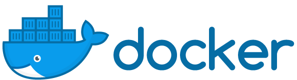

# Learn Docker

## Introduction
- [Docker 101 for Developer](https://drive.google.com/open?id=1-uBd0zgHvskfPmRdY2szx8W9U0lLiR8clIOa8URpVrU) - presentaion
- [A Docker Tutorial for Beginners](https://docker-curriculum.com/)

## Best Practices
- [Dockerfile Best Practices](https://drive.google.com/open?id=16t_-DRTohzyVPJy6Cx8a3PxLQ-95CfYK) - presentaion
- [Best practices for writing Dockerfiles](https://docs.docker.com/develop/develop-images/dockerfile_best-practices/)
- [Intro Guide to Dockerfile Best Practices](https://blog.docker.com/2019/07/intro-guide-to-dockerfile-best-practices/)
- [เทคนิคการเขียน Dockerfile ให้ดีขึ้นกว่าเดิม](https://is.gd/ZVZWk9)

## Others
 - [Some typical docker compose templates](https://github.com/yeasy/docker-compose-files)
